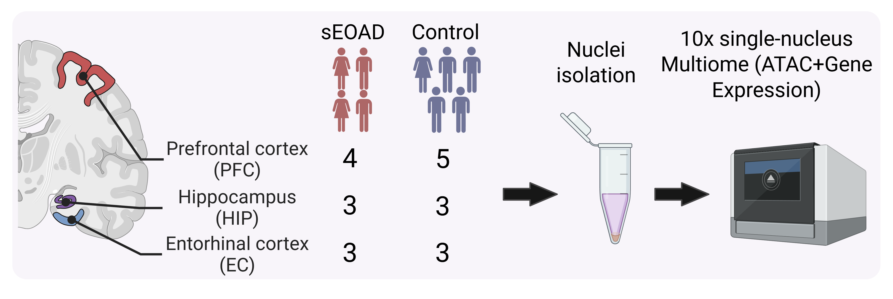

# snMultiome_sEOAD
Single-nucleus multiomics reveals the disrupted regulatory programs in three brain regions in sporadic early-onset Alzheimer's disease

# Description
Sporadic early-onset Alzheimer’s disease (sEOAD) represents a significant but less-studied subtype of Alzheimer’s disease (AD). Here, we generated a single-nucleus multiome atlas derived from the postmortem prefrontal cortex, entorhinal cortex, and hippocampus of individuals with or without sEOAD.

# Contact
Please contact Zhongming Zhao (zhongming.zhao@uth.tmc.edu) if you have any questions.
